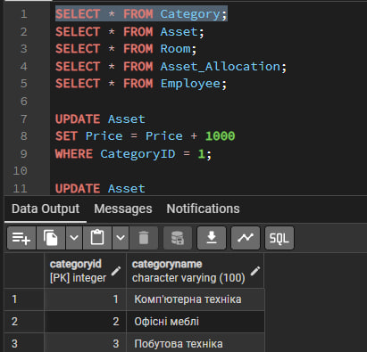
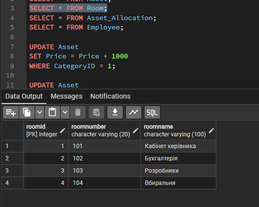
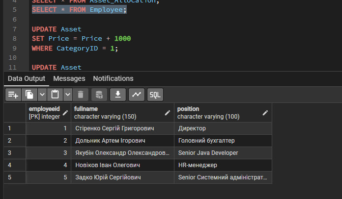
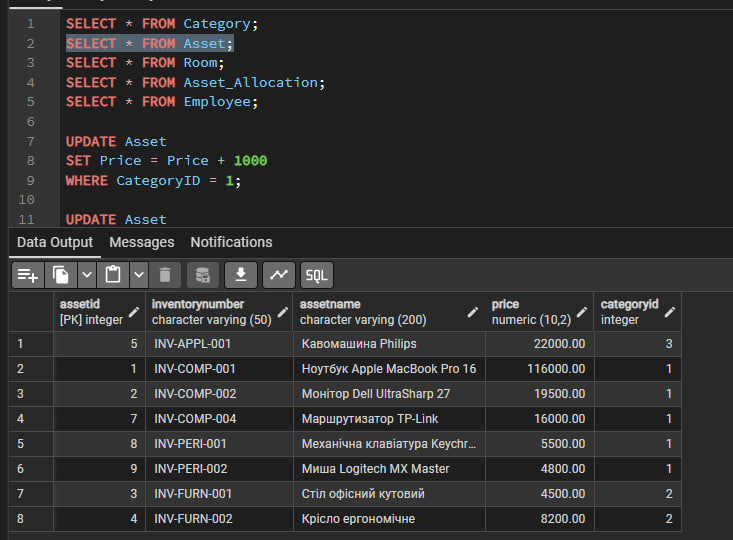
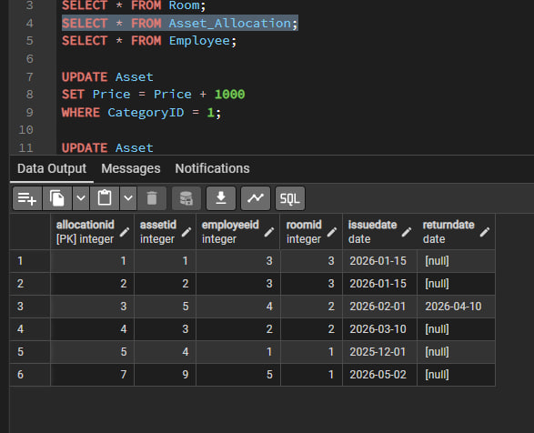

# Лабораторна робота №3: Маніпулювання даними SQL (OLTP)

## 1. SQL Скрипти (DML операції)
Файл з повним кодом усіх виконаних команд `SELECT`, `INSERT`, `UPDATE` та `DELETE`: 
 [Переглянути скрипт Lab3_DML.sql](./Lab3_DML.sql)

 Натисніть, щоб розгорнути скріншоти стану таблиць 

#### Таблиця Category

#### Таблиця Room

#### Таблиця Employee 

#### Таблиця Asset 

#### Таблиця Asset_Allocation

